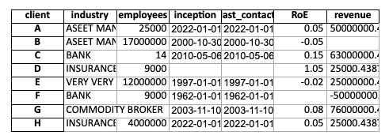
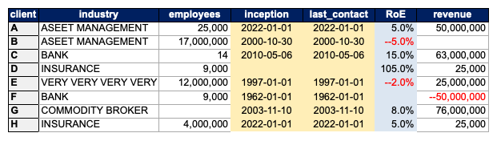

# BeautifulExcel

> **⚠️🏗️️ Note:**
> This is only the first version - actively working on additional features!

BeautifulExcel is a python package that makes it easy and quick to save pandas dataframes in beautifully formatted excel files. BeautifulExcel is the Openpyxl for Data Scientists with a deadline.
  
<br>
  
## Getting it

```console
$ pip install beautifulexcel
```
  
<br>
  
## Pandas vs. BeautifulExcel .to_excel()

| Pandas                                                                                        | BeautifulExcel                                                                                        |
| --------------------------------------------------------------------------------------------- | ----------------------------------------------------------------------------------------------------- |
| `df.to_excel(writer, sheet_name='My Output')`                                                 | `writer.to_excel(df, sheet_name='My Output')`                                                         |
|  |  |
  
<br>
  
## How to use:

```python
from beautifulexcel import ExcelWriter

with ExcelWriter('workbook.xlsx', mode='r', theme='elegant_blue') as writer:
    ws1 = writer.to_excel(df, sheet_name='My Sheet', startrow=0, startcol=0, index=True,
                          style={'RoE': 'bg_light_blue', 'D:E': {'fill': 'FFEEB7'}})
```
  
<br>
  
## How does styling work?

### Define a "theme"

In `ExcelWriter(..., theme='elegant_blue')` you cen define the base theme that will be applied to your entire Excel file.  
You can pass either:

- a ***theme name*** of the package's included themes like 'elegant_blue', or
- pass a ***path*** to your personal ***.yml-theme-file*** _(have a look at [this file](beautifulexcel/themes/elegant_blue.yml) to see the syntax)_

### Add "style" kwargs for the specific dataframe export .to_excel()

In `writer.to_excel(..., style={})` you can define specific styling kwargs for that specoific table.  
The **style** dictionar requires:

- as **_key_** a reference for the column, row, or cell. This can have these formats:
  - ***df column name*** like 'emplyees' or range 'inception:last_contact'
  - ***df row number*** like 1 or range '1:5'
  - ***excel column*** 'A1' or range 'A1:C3'
  - ***excel column*** 'A' or range 'A:C'
- as **_value_** provide how that area should be formatted. This can have these formats:
  - quick reference ***preset name*** from the theme selected e.g. 'bg*light_blue' or list of several themes ['bg_light_blue', 'num_fmt_pct'] *(see the presets defined for ['elegant_blue' here](beautifulexcel/themes/elegant_blue.yml))*
  - ***dictionary*** with the individual ***styling props*** following [**openpyxl's class names** (here)](https://openpyxl.readthedocs.io/en/stable/styles.html). Examples:
    - _font\_\_name: 'Arial'_
    - _font\_\_size: 10_
    - _font\_\_bold: True_
    - ...
    - _fill: 'FFEEB7' (short for solid patternfill)_
    - _patternfill\_\_type: 'solid'_
    - _patternfill\_\_fgColor: 'FFEEB7'_
    - ...
    - _alignment\_\_horizontal: 'center'_
    - _alignment\_\_vertical: 'center'_
    - ...
    - _numberformat: '#,##0'_
    - [_(see **openpyxl's class names** for more style options)_](https://openpyxl.readthedocs.io/en/stable/styles.html)

**Example:** _(showcasing the many different styling options)_

```python
MY_CUSTOM_WARNING_STYLE = {'font__bold': True, 'text__color': 'ff0000', 'font__size': 20}
MY_CUSTOM_DATE_STYLE = {'numberformat': 'yyyy-mm-dd'}

style = {
    'emplyees': 'bg_light_blue',
    'inception:last_contact': ['bg_light_blue', 'num_fmt_pct'],
    '1': MY_CUSTOM_WARNING_STYLE,
    '1:5': {'numberformat': '#,##0', 'font__italic'=True},
    'A1': {'font__italic'=True},
    'A1:C3': MY_CUSTOM_DATE_STYLE,
    'D': {'font__size': 20},
    'C:D': {**MY_CUSTOM_WARNING_STYLE, 'numberformat': '#,##0', 'font__italic'=True}
}
```
